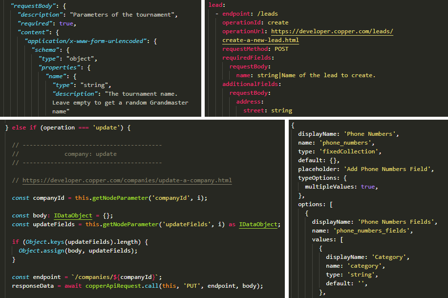

<p align="center">
  
</p>

<p align="center">
  <h1 align="center">Nodebuilder</h1>
</p>

<p align="center">
  Build n8n nodes from OpenAPI specs and YAML files<br />
  by <a href="https://github.com/ivov">Iván Ovejero</a>
</p>

<p align="center">
  <a href="#installation">Installation</a> •
  <a href="#operation">Operation</a> •
  <a href="/docs/yaml-mapping.md">YAML Mapping</a>
</p>

<p align="center">
  
  <a href="https://github.com/n8n-io"></a>
  
</p>

<br/>

**Nodebuilder** is a utility to generate n8n node files from [OpenAPI specs](https://github.com/OAI/OpenAPI-Specification) and from [custom YAML mappings](#yaml).

Developed to automate the node creation process for:
- `*.node.ts`, main logic for a regular node,
- `GenericFunctions.ts`, helper functions, and
- `*Description.ts`, parameter descriptions.

<!-- <p align="center">
  
</p> -->

**Features**
- Logic for CRUD operations
- Alphabetization and casing
- Endpoints with string literals
- Required params and additional fields
- Nested params in fixed collections
- Adding `target="_blank"` to links
- Default values for params
- YAML input validation
- Comment dividers

Project in MVP status - issues welcome

**Pending**

- General:
  - Implement testing with [`git.js`](https://github.com/steveukx/git-js)
  - Explore integration with [VSCode YAML](https://github.com/redhat-developer/vscode-yaml)
- OpenAPI:
  - Find edge cases in more OpenAPI specs.
  - Add intermediate step to restructure step resources and operations.
- YAML:
  - Rename `enum` to `options`.
  - Add support for `multiOptions`
- Generator:
  - Add resource loaders to the TypeScript generator.
  - Generate `*.credentials.ts`

## Installation

```sh
$ git clone https://github.com/ivov/nodebuilder.git
$ cd nodebuilder && npm i
```

## Operation

### OpenAPI

1. Place the input file in `src/input/openApi`
2. Run `npm run generate`
3. Inspect `src/output`

Notes:
- OpenAPI parsing may fail at undetected edge cases. If your spec cannot be parsed, please open an issue.
- OpenAPI parsing needs to be adjusted to respect n8n's resources-and-operations format. Work in progress.

### YAML

1. Write a YAML file in `src/input/yaml`
2. Run `npm run generate`
3. Inspect `src/output`

For a full description of how to describe an API in YAML, refer to [this explanation](https://github.com/ivov/nodebuilder/blob/main/docs/yaml-mapping.md).

For a full example of an API description in YAML, refer to [`copper.yaml`](https://github.com/ivov/nodebuilder/blob/main/src/input/yaml/copper.yaml).

## Author

© 2021 [Iván Ovejero](https://github.com/ivov)

## License

Distributed under the MIT License. See [LICENSE.md](LICENSE.md).
